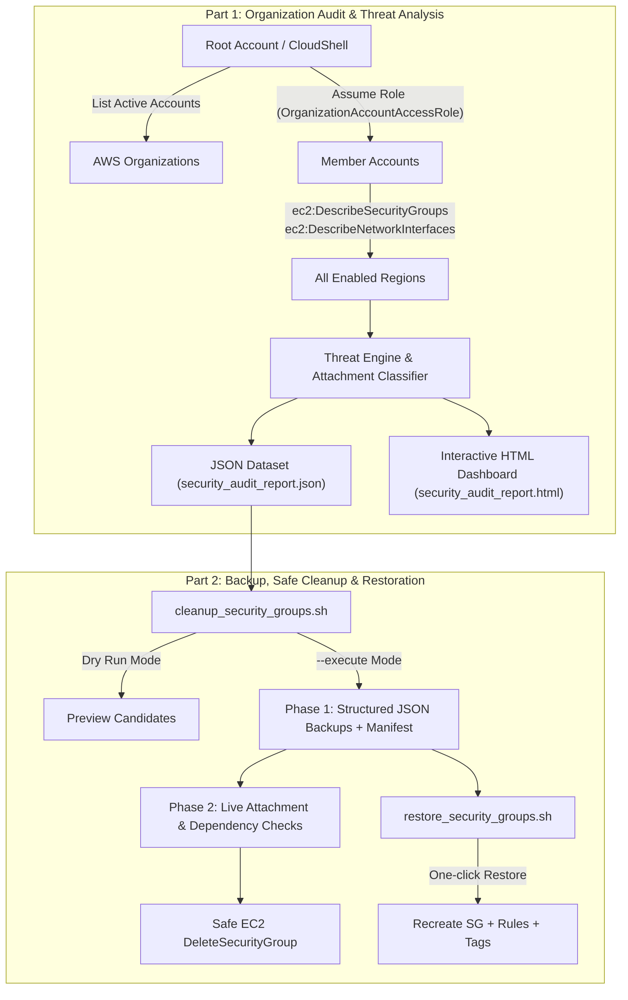

# AWS Organization Security Group Audit, Threat Detection & Automated Remediation Suite

An enterprise-ready, multi-account, multi-region security audit and cleanup toolkit designed to run from an **AWS Organization Root / Management Account** (or delegated administrator).

---

## 🎯 Key Capabilities



### 1. Security Audit & Threat Detection
- **Multi-Account & Multi-Region Discovery**: Automatically enumerates all active member accounts in your AWS Organization and scans all enabled EC2 regions.
- **Authoritative Attachment Detection**: Identifies whether a Security Group has active resources attached by querying Elastic Network Interfaces (ENIs). Covers EC2 instances, Application/Network Load Balancers, RDS databases, Lambda VPC interfaces, ECS/EKS tasks, and VPC Endpoints.
- **Automated Threat Severity Classification**:
  - **CRITICAL**: Global internet ingress (`0.0.0.0/0` or `::/0`) to administrative ports (SSH 22, RDP 3389, Telnet 23, WinRM 5985/5986, VNC 5900), databases (MySQL 3306, Postgres 5432, MSSQL 1433, Oracle 1521, MongoDB 27017, Redis 6379, OpenSearch 9200), or all traffic (`-1` / 0-65535).
  - **HIGH**: Global internet ingress to internal APIs & services (Kubernetes API 6443, Docker 2375/2376, LDAP 389/636, SMB 445, NFS 2049, DNS 53, SMTP 25) or wide port ranges (>100 ports).
  - **MEDIUM**: Internet exposed web services (HTTP 80, HTTPS 443, 8080, 8443) flagged for ALB/WAF verification.
  - **LOW / CLEAN**: Internal traffic only (RFC 1918 private subnets: 10.0.0.0/8, 172.16.0.0/12, 192.168.0.0/16 or security group references).
- **CIS AWS Foundations Benchmark Compliance**: Flags default VPC security groups (`GroupName: default`) that contain open rules or are attached to resources.
- **Actionable Recommendations**:
  - `CAN_DELETE`: Unattached (0 ENIs) and non-default.
  - `RESTRICT_IMMEDIATELY`: Attached to active resources with CRITICAL/HIGH public exposure.
  - `REVIEW_EXPOSURE`: Attached web services (confirm ALB/WAF protection).
  - `DEFAULT_RESTRICT`: Default SG (revoke all inbound and outbound rules).
  - `SAFE_IN_USE`: Attached to active resources with internal/private traffic only.

### 2. Interactive Standalone HTML Report
- **Zero External Dependencies**: Embedded CSS, JS, and SVG icons. Runs completely offline, in air-gapped environments, or behind corporate proxies.
- **Executive Metrics**: Cards displaying Total SGs, Critical Threats, High Threats, Internet Exposed, Safe to Delete, and Default SGs.
- **Live Search & Multi-Faceted Filters**: Filter dynamically by Account, Region, Severity, Recommendation, Attachment Status, or Internet Exposure.
- **Detailed Row Expansion**: Inspect individual Ingress Rules, Egress Rules, Attached ENIs / EC2 instances, and Tags.
- **Instant Exports**: One-click **Export to CSV** for spreadsheets and **Export Cleanup List** for batch remediation.

### 3. Backup & Safe Cleanup Tool (`cleanup_security_groups.sh`)
- **Strict Safety Controls**: Defaults to `--dry-run` simulation. Requires `--execute` and interactive confirmation (`CONFIRM`) or `--yes` to perform modifications.
- **Identifiable & Structured Backups**: Creates full JSON dumps prior to any deletion or rule removal:
  `backups/<timestamp>/<account_id>_<account_name>/<region>/<sg_id>_<sg_name>.json`
- **Master Manifest**: Maintains `backup_manifest.json` indexing all backed-up groups and actions taken.
- **Default VPC Security Group Handling (CIS AWS Benchmark 5.4)**:
  AWS explicitly prevents default security groups from being deleted (`Client.CannotDelete`).
  Instead, this tool safely backs up the default security group and **removes all of its ingress rules only**, neutralizing accidental exposure while preserving the required default resource.
- **Real-Time Guardrails**:
  - Live re-verifies 0 ENIs attached before calling delete on non-default groups (prevents race conditions).
  - Gracefully handles and logs `DependencyViolation` when another SG references the candidate group.

### 4. Restoration Utility (`restore_security_groups.sh`)
- Effortlessly recreate security groups or restore revoked ingress rules from any backup JSON or manifest.
- Re-creates non-default SGs in the target VPC with all original rules and tags.
- For default SGs, locates the existing default SG in the target VPC and re-applies the original ingress rules.

---

## 📋 Prerequisites & IAM Setup

### Prerequisites
- **AWS CLI v2** installed and configured (`aws --version`).
- `jq` or `python3` (both supported with automatic detection).
- Execution environment: **AWS CloudShell** (recommended: zero configuration required!), Linux EC2 bastion host, macOS, or Windows (Git Bash / WSL).

### IAM Permissions
When running from the **Organization Management (Root) Account**, ensure your role/user has:
1. `organizations:ListAccounts`
2. `sts:AssumeRole` to assume the cross-account role in member accounts.

#### Cross-Account Role in Member Accounts
By default, AWS Organizations creates `OrganizationAccountAccessRole` (or AWS Control Tower creates `AWSControlTowerExecution`) in each member account with `AdministratorAccess`.

If you prefer a least-privilege IAM policy in member accounts, attach this policy:

```json
{
  "Version": "2012-10-17",
  "Statement": [
    {
      "Sid": "SecurityGroupAuditAndRemediation",
      "Effect": "Allow",
      "Action": [
        "ec2:DescribeSecurityGroups",
        "ec2:DescribeNetworkInterfaces",
        "ec2:DescribeRegions",
        "ec2:DescribeVpcs",
        "ec2:DeleteSecurityGroup",
        "ec2:RevokeSecurityGroupIngress",
        "ec2:CreateSecurityGroup",
        "ec2:AuthorizeSecurityGroupIngress",
        "ec2:AuthorizeSecurityGroupEgress",
        "ec2:CreateTags"
      ],
      "Resource": "*"
    }
  ]
}
```

---

## 🚀 Quick Start Guide

### Step 1: Clone / Download Repository
```bash
git clone <repo-url>
cd "security group"
chmod +x *.sh lib/*.sh test/*.sh
```

---

### Step 2: Part 1 - Run the Security Audit

Scan all member accounts and all regions in your AWS Organization:

```bash
./audit_security_groups.sh
```

#### Custom Options:
```bash
# Assume a custom cross-account role (e.g. AWS Control Tower)
./audit_security_groups.sh --role-name AWSControlTowerExecution

# Target specific member accounts
./audit_security_groups.sh --accounts 111122223333,444455556666

# Target specific regions
./audit_security_groups.sh --regions us-east-1,us-west-2,eu-west-1

# Specify custom output directory
./audit_security_groups.sh --output-dir ./audit_reports/q3_audit
```

#### Audit Output:
```
================================================================================
 Security Group Audit Complete
================================================================================
Total Accounts Scanned           : 12
Total Regions Evaluated          : 4
Total Security Groups Found      : 184
Critical Threat Exposures        : 7
High Threat Exposures            : 12
Internet Exposed (0.0.0.0/0)     : 24
Safe to Delete (Unattached)      : 42
Default SGs (Restrict Traffic)   : 12

[SUCCESS] Audit JSON Dataset:  ./audit_results/20260926_120000/security_audit_report.json
[SUCCESS] Interactive HTML:    ./audit_results/20260926_120000/security_audit_report.html
```

Open `security_audit_report.html` in any browser to review the visual dashboard!

---

### Step 3: Part 2 - Preview & Remediate Security Groups

The cleanup tool automatically differentiates between:
- **Unattached non-default security groups:** Backed up and **permanently deleted**.
- **Default VPC security groups (`default`):** Cannot be deleted by AWS API; backed up and **all ingress rules revoked**.

#### 1. Dry Run (Preview Only - No Changes Made):
Preview remediation candidates identified during the audit:
```bash
./cleanup_security_groups.sh --audit-file ./audit_results/20260926_120000/security_audit_report.json
```

#### 2. Execute Backup & Remediation:
Safely archive candidate security groups, delete unattached groups, and revoke default SG ingress rules:
```bash
./cleanup_security_groups.sh --audit-file ./audit_results/20260926_120000/security_audit_report.json --execute
```
*(The script prompts for typed confirmation `CONFIRM` before taking action. To bypass for CI/CD pipelines, pass `--yes`).*

#### 3. Target Specific Accounts or a Single Security Group:
```bash
# Remediate a specific account and region directly
./cleanup_security_groups.sh --accounts 111122223333 --regions us-east-1 --execute

# Target a single security group ID
./cleanup_security_groups.sh --sg-id sg-0123456789abcdef0 --accounts 111122223333 --regions us-east-1 --execute
```

---

### Step 4: Restoring Security Groups from Backup

If you ever need to restore any deleted security group:

#### Restore a Single Security Group:
```bash
# Dry run preview of restoration
./restore_security_groups.sh --backup-file ./backups/20260926_120000/111122223333_Production/us-east-1/sg-0123456789abcdef0_old-web-sg.json

# Execute restoration
./restore_security_groups.sh --backup-file ./backups/20260926_120000/111122223333_Production/us-east-1/sg-0123456789abcdef0_old-web-sg.json --execute
```

#### Restore All Security Groups from a Manifest:
```bash
./restore_security_groups.sh --manifest ./backups/20260926_120000/backup_manifest.json --execute
```

#### Restore into a Different VPC (if original VPC was deleted):
```bash
./restore_security_groups.sh --backup-file ./backups/.../sg-xxx.json --target-vpc-id vpc-0987654321fedcba0 --execute
```

---

## 🧪 Automated Test Suite

A built-in test runner is included to verify the threat engine, HTML dashboard generation, backup manifest handling, and restoration:

```bash
./test/run_tests.sh
```

---

## 📂 Project Structure

```
security group/
├── audit_security_groups.sh      # Part 1: Organization-wide scanner & HTML generator
├── cleanup_security_groups.sh    # Part 2: Backup & safe deletion of unattached SGs
├── restore_security_groups.sh    # Part 2: Re-creation & restore tool from JSON backups
├── config.env.example            # Environment configuration template
├── README.md                     # Comprehensive documentation
├── lib/
│   ├── common.sh                 # Shared auth, assume-role, logging, prerequisites
│   ├── threat_engine.sh          # Threat analysis bash coordinator
│   ├── threat_analyzer.py        # Threat risk scoring & port evaluation engine
│   └── html_generator.sh         # Single-file HTML dashboard builder
├── templates/
│   └── report_template.html      # Responsive HTML5/CSS3/JS audit dashboard template
└── test/
    ├── run_tests.sh              # Automated test suite
    ├── mock_sgs.json             # Test dataset with realistic threat scenarios
    ├── mock_enis.json            # Test network interfaces dataset
    └── mock_bin/                 # Mock testing shims
```
